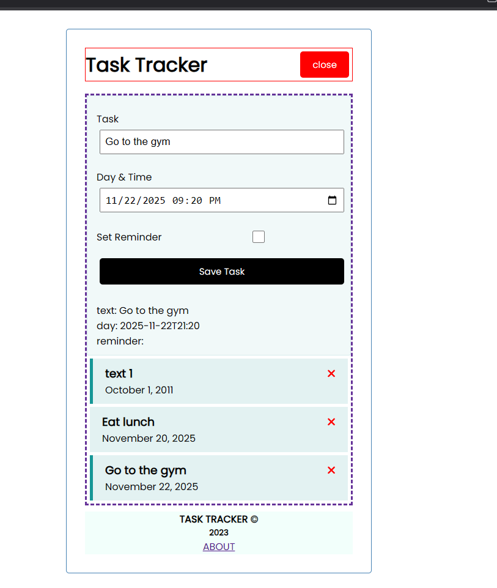

# AngularTracker

This project was generated with [Angular CLI](https://github.com/angular/angular-cli) version 18.2.21.

## Versions

```text
     _                      _                 ____ _     ___
    / \   _ __   __ _ _   _| | __ _ _ __     / ___| |   |_ _|
   / △ \ | '_ \ / _` | | | | |/ _` | '__|   | |   | |    | |
  / ___ \| | | | (_| | |_| | | (_| | |      | |___| |___ | |
 /_/   \_\_| |_|\__, |\__,_|_|\__,_|_|       \____|_____|___|
                |___/

Angular CLI: 18.2.21
Node: 20.11.1
Package Manager: npm 10.2.4
OS: win32 x64

Angular:
...

Package                      Version
------------------------------------------------------
@angular-devkit/architect    0.1802.21 (cli-only)
@angular-devkit/core         18.2.21 (cli-only)
@angular-devkit/schematics   18.2.21 (cli-only)
@schematics/angular          18.2.21 (cli-only)
```


